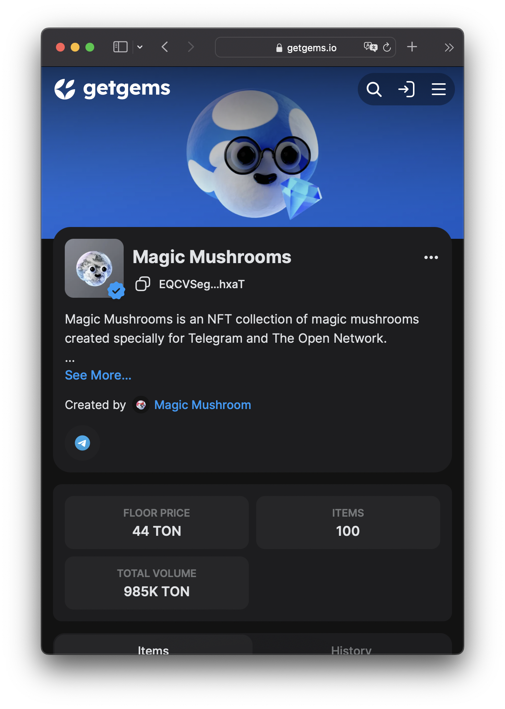
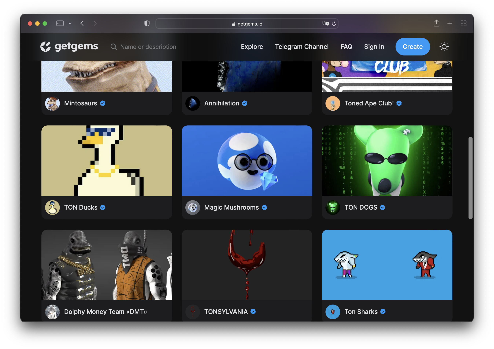
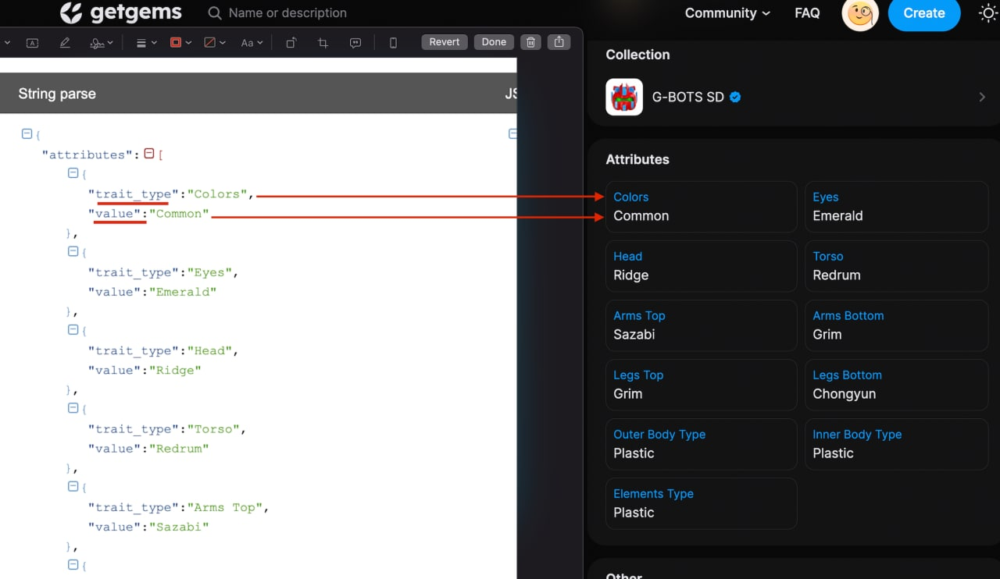
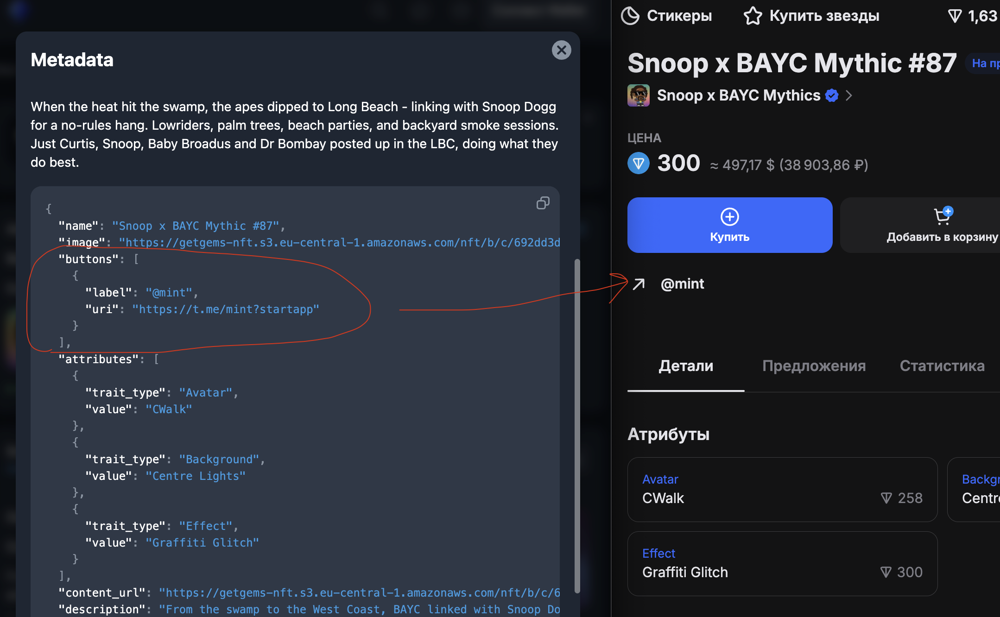

## Collection metadata


Here’s an example of a collection metadata JSON file.

```json
{
  "name": "Magic Mushrooms",
  "description": "Magic Mushrooms is an NFT collection of magic mushrooms created specially for Telegram and The Open Network.\n\nHand drawing brings the collection an artistic value, while various accessories and materials bring uniqueness and significance in our rapidly changing world.",
  "image": "https://s.getgems.io/nft/c/62695cb92d780b7496caea3a/avatar.png",
  "cover_image": "https://s.getgems.io/nft/c/62695cb92d780b7496caea3a/cover.png",
  "social_links": [
    "https://t.me/ton_magic_mushrooms"
  ]
}
```

|                  |                                                      |                                                                                                                                                                                                                                                                                                                                                         |
|------------------|------------------------------------------------------|---------------------------------------------------------------------------------------------------------------------------------------------------------------------------------------------------------------------------------------------------------------------------------------------------------------------------------------------------------|
| [1] name         | Collection name                                      | Recommended length: No more than 15-30 characters                                                                                                                                                                                                                                                                                                       |
| [2] description  | Collection description                               | Recommended length: Up to 500 characters                                                                                                                                                                                                                                                                                                                |
| [3] image        | Image link                                           | This image will be displayed as the avatar. Supported link formats: https and ipfs Recommended image size: a square between 400x400 and 1000x1000 pixels Format: png, jpg, webp, svg Size: under 30 MB For animated images, please use fewer than 100 frames.                                                                                           |
| [4] cover_image  | Cover image link                                     | This image will be displayed as the collection’s cover image.Supported link formats: https and ipfs. Recommended image size: 2880x680 pixels Format: png, jpg, webp, svg Size: under 30 MB For animated images, please use fewer than 30 frames. Please note that this image is also used for the collection preview, see the accompanying screenshots. |
| [5] social_links | List of links to the project’s social media profiles | Use no more than 10 links.                                                                                                                                                                                                                                                                                                                              |






## NFT metadata

Here’s an example of an NFT metadata JSON file.

```json
{
  "name": "Magic Mushroom #57",
  "description": "Hand drawing brings the NFT an artistic value, while various accessories and materials bring uniqueness and significance in our rapidly changing world.",
  "image": "https://s.getgems.io/nft/c/62695cb92d780b7496caea3a/nft/56/629b9349e034e8e582cf6448.png",
  "attributes": [
    {
      "trait_type": "Material",
      "value": "Wool fabric"
    },
    {
      "trait_type": "Hat",
      "value": "Top hat"
    },
    {
      "trait_type": "Glasses",
      "value": "None"
    },
    {
      "trait_type": "Item",
      "value": "None"
    },
    {
      "trait_type": "Background",
      "value": "Dark"
    }
  ]
}
```

We recommend you follow the specifications below in order to correctly mint your NFTs:

|              |                                                                                       |                                                                                                                                                                                                                                                                                       |
|--------------|---------------------------------------------------------------------------------------|---------------------------------------------------------------------------------------------------------------------------------------------------------------------------------------------------------------------------------------------------------------------------------------|
| name         | NFT name                                                                              | Recommended length: No more than 15-30 characters                                                                                                                                                                                                                                     |
| description  | NFT description                                                                       | Recommended length: Up to 500 characters                                                                                                                                                                                                                                              |
| image        | Image link                                                                            | This image will be displayed as the avatar. Supported link formats: https and ipfs Recommended image size: 1000x1000 pixels Format: png, jpg, webp, svg Size: under 30 MB If you are minting an animated NFT, we suggest you use the first frame of the video as the fixed NFT image. |
| content_type | The type of content added through the content_url link For example, a video/mp4 file. |
| content_url  | Link to additional content                                                            | At the moment only video, mp4 webm QuickTime or mpeg files are supported. Max file size: 100 MB Recommended size: 1000x1000 pixels                                                                                                                                                    |
| lottie       | Link to the json file with Lottie animation                                           | If specified, the Lottie animation from this link will be played on page with the NFT. See the examples of NFTs with Lottie animation.                                                                                                                                                |
| attributes   | NFT attributes                                                                        | A list of attributes, where a trait_type (attribute name) and value (a short description of the attribution) is specified. Please find an example below. The trait_type and value must be shorter than 128 characters                                                                 |
| buttons      | Array of urls                                                                         | Array of objets `{label:string, uri:string}` `label` - name, max 24 length, `uri` - http url [Example](https://getgems.io/collection/EQCww4swmVn32HICB5E19COsPsyEXaiw-3ZaBcEsiKt-DGKi/EQAoWa-72WRyidUaaOzOtFJgLHi4f017TAFfZSIHB_35maCZ)                                               |




