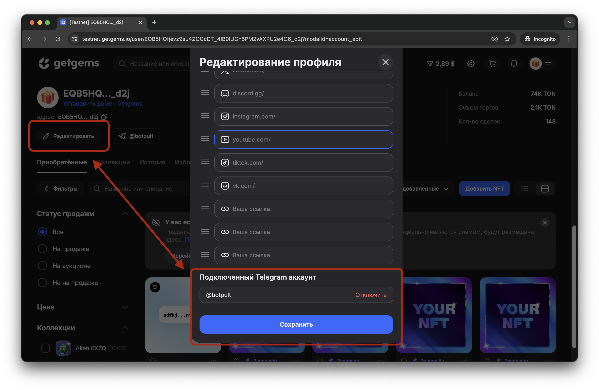
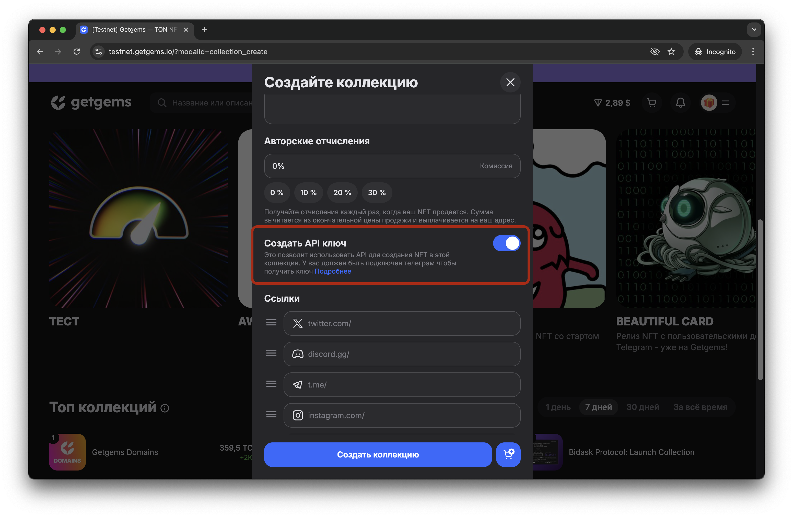
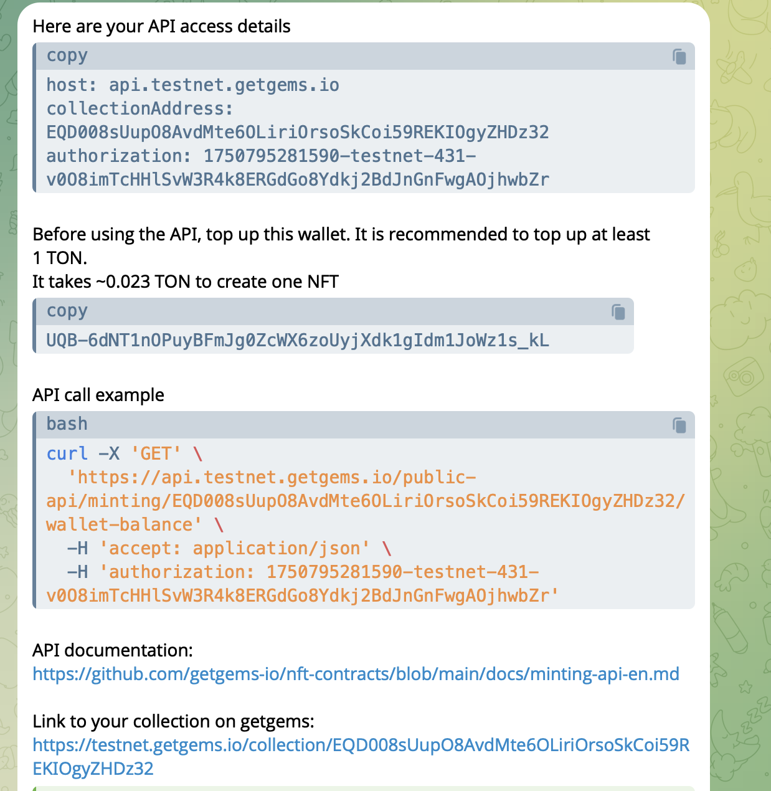

# Начало работы с API getgems для минтинга NFT

Начинать работать с API лучше в тестовой сети TON testnet.getgems.io, принцип работы будет точно такой-же, 
но не придется тратить настоящие тоны.  
- Тестовые тоны можно получить в этом боте http://t.me/testgiver_ton_bot 
- Общая информация о testnet есть в документации https://docs.ton.org/v3/documentation/smart-contracts/getting-started/testnet
- Инструкция Tonkeeper https://tonkeeper.helpscoutdocs.com/article/100-how-switch-to-the-testnet

### Авторизуйтесь на getgems и привяжите телеграм аккаунт
данные для авторизации придут в телеграм бота

### Создайте коллекцию NFT с ключом API
https://testnet.getgems.io/?modalId=collection_create

### Дождитесь сообщения от бота с данным для авторизации API

### Изучите документацию API
[minting-api-ru.md](minting-api-ru.md)
